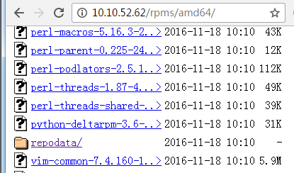

# 创建私有YUM源

创建YUM源的步骤和创建apt-get源的步骤一样。

1. Install "createrepo", httpd
2. Create Repository directory & Copy Packages to apache web directory
3. Run "createrepo"
4. Create YUM Repository Configuration file


### 开启yum缓存

需要将 keepcache 的值设置为 1 , 缓存下来的包可以在 /var/cache/yum/x86_64/7/base/packages/ 目录中看到。

```
# vi /etc/yum.conf
keepcache=1

# yum install vim -y

# ls /var/cache/yum/x86_64/7/base/packages/
gpm-libs-1.20.7-5.el7.x86_64.rpm      perl-libs-5.16.3-286.el7.x86_64.rpm             perl-Storable-2.45-3.el7.x86_64.rpm
perl-5.16.3-286.el7.x86_64.rpm       
... ...

```


## Install "createrepo"

安装工具包

```
# yum install createrepo -y
# yum install httpd -y
# systemctl start httpd.service
```


## Create Repository directory & Copy Packages

将所有的rpm包拷贝到apache的web目录下面，并且保证别的机器能够访问到。

```
# mkdir -p /var/www/html/rpms/amd64
# cp /var/cache/yum/x86_64/7/base/packages/*.rpm /var/www/html/rpms/amd64
```

拷贝完成后，可以通过浏览器测试一下是否能够正常访问。




## Run "createrepo"

运行 createrepo 会创建一个 repodata 目录，里面保存的就是当前源的包信息，每次加入新包的时候，都要再次执行 createrepo 命令以更新包信息。

```
# cd /var/www/html/rpms/amd64
# createrepo /var/www/html/rpms/amd64
Spawning worker 0 with 17 pkgs
Spawning worker 1 with 16 pkgs
Workers Finished
Saving Primary metadata
Saving file lists metadata
Saving other metadata
Generating sqlite DBs
Sqlite DBs complete
```


## Create YUM Repository Configuration file

到目前为止，yum源已经搭建完成，接下来只需要在其他机器上配置当前私有源即可使用。

```
# rm -rf /etc/yum.repos.d/*

# vim /etc/yum.repos.d/custom.repo
[customrepo]
name=Custom Repository
baseurl=http://10.10.52.62/rpms/amd64/
enabled=1
gpgcheck=0

# yum clean all
# yum makecache
```


参考资料
[https://www.digitalocean.com/community/tutorials/how-to-set-up-and-use-yum-repositories-on-a-centos-6-vps](https://www.digitalocean.com/community/tutorials/how-to-set-up-and-use-yum-repositories-on-a-centos-6-vps)