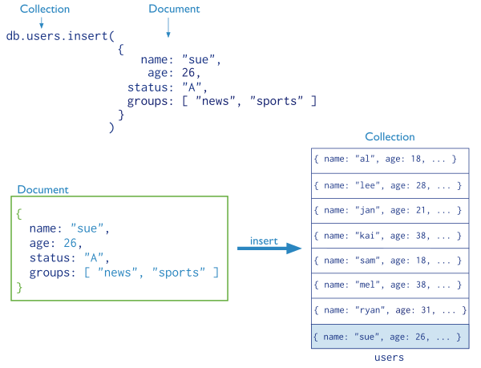
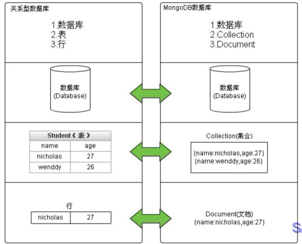

# MongoDB学习笔记 - day1


## Install/Uninstall MongoDB

```shell
# Install --------------------
$ sudo apt-get install mongodb-server
$ sudo service mongod stop/start/restart


# Uninstall ------------------
# Stop MongoDB
$ sudo service mongod stop

# Remove Packages
$ sudo apt-get purge mongodb

# Remove Data Directories
$ sudo rm -r /var/log/mongodb
$ sudo rm -r /var/lib/mongodb
```


## 基本概念

+ **Documents**

> A record in MongoDB is a document, which is a data structure composed of field and value pairs. MongoDB documents are similar to JSON objects. The values of fields may include other documents, arrays, and arrays of documents.


+ **Collections**

> MongoDB stores documents in collections. Collections are analogous to tables in relational databases. Unlike a table, however, a collection does not require its documents to have the same schema. 
> In MongoDB, documents stored in a collection must have a unique _id field that acts as a primary key.

Documents 就相当于关系型数据中的一条记录，Collections就类似关系型数据库中的一张表。二者关系如下图所示：


**MongoDB 和关系型数据库对应关系**



## Mongo shell 基本命令

```
# 进入mongo命令行
$ mongo

# 查看帮助
> help

# 查看db对应的帮助
> db.help()

# 查看collection对应的帮助
> db.<collection>.help()

# 查看所有的数据库
> show dbs

# 切换到某个数据库
> use <db>

# 查看所有的collection
> show collections

# 查看所有的用户
> show users

# 插入数据
> db.restaurants.insert(
   {
      "address" : {
         "street" : "2 Avenue",
         "zipcode" : "10075",
         "building" : "1480",
         "coord" : [ -73.9557413, 40.7720266 ],
      },
      "borough" : "Manhattan"
    }
)

# 查询数据
> db.restaurants.find()
> db.restaurants.find( { "borough": "Manhattan" } )
> db.restaurants.find( { "address.zipcode": "10075" } )
> db.restaurants.find( { "grades.score": { $gt: 30 } } )
> db.restaurants.find( { "cuisine": "Italian", "address.zipcode": "10075" } )
> db.restaurants.find(
   { $or: [ { "cuisine": "Italian" }, { "address.zipcode": "10075" } ] }
)
> db.restaurants.find().sort( { "borough": 1, "address.zipcode": 1 } )

# 更新数据
> db.restaurants.update(
    { "name" : "Juni" },
    {
      $set: { "cuisine": "American (New)" },
      $currentDate: { "lastModified": true }
    }
)
> db.restaurants.update(
  { "address.zipcode": "10016", cuisine: "Other" },
  {
    $set: { cuisine: "Category To Be Determined" },
    $currentDate: { "lastModified": true }
  },
  { multi: true}
)
> db.restaurants.update(
   { "restaurant_id" : "41704620" },
   {
     "name" : "Vella 2",
     "address" : {
              "coord" : [ -73.9557413, 40.7720266 ],
              "building" : "1480",
     }
   }
)

# 删除数据
> db.restaurants.remove( { "borough": "Manhattan" } )
> db.restaurants.remove( { "borough": "Queens" }, { justOne: true } )
> db.restaurants.remove( { } )
> db.restaurants.drop()

# 记录统计
> db.restaurants.aggregate(
   [
     { $group: { "_id": "$borough", "count": { $sum: 1 } } }
   ]
);
> db.restaurants.aggregate(
   [
     { $match: { "borough": "Queens", "cuisine": "Brazilian" } },
     { $group: { "_id": "$address.zipcode" , "count": { $sum: 1 } } }
   ]
);

# 索引
db.restaurants.createIndex( { "cuisine": 1 } )
db.restaurants.createIndex( { "cuisine": 1, "address.zipcode": -1 } )
```


## PyMongo

### 安装 PyMongo

```shell
$ pip install pymongo
```

[https://pypi.python.org/pypi/pymongo/](https://pypi.python.org/pypi/pymongo/)


### 引入 pymongo

```python
from pymongo import MongoClient


# If you do not specify any arguments to MongoClient, then MongoClient defaults to the MongoDB instance that runs on the localhost interface on port 27017.
client = MongoClient()
client = MongoClient("mongodb://mongodb0.example.net:27019")

# To assign the local variable db to the database named primer, you can use attribute access, as in the following:
db = client.primer
db = client['primer']

# You can access collection objects directly using dictionary-style or attribute access from a Database object, as in the following examples:
coll = db.dataset
coll = db['dataset']

```


### 使用 pymongo

#### 插入数据

> You can use the insert_one() method and the insert_many() method to add documents to a collection in MongoDB. If you attempt to add documents to a collection that does not exist, MongoDB will create the collection for you.

```python
from datetime import datetime
result = db.restaurants.insert_one(
    {
        "address": {
            "street": "2 Avenue",
            "zipcode": "10075",
            "building": "1480",
            "coord": [-73.9557413, 40.7720266]
        },
        "borough": "Manhattan",
        "cuisine": "Italian",
        "grades": [
            {
                "date": datetime.strptime("2014-10-01", "%Y-%m-%d"),
                "grade": "A",
                "score": 11
            },
            {
                "date": datetime.strptime("2014-01-16", "%Y-%m-%d"),
                "grade": "B",
                "score": 17
            }
        ],
        "name": "Vella",
        "restaurant_id": "41704620"
    }
)
```

> If the document passed to the insert_one() method does not contain the _id field, MongoClient automatically adds the field to the document and sets the field’s value to a generated ObjectId.

#### 查询数据

> You can use the find() method to issue a query to retrieve data from a collection in MongoDB. All queries in MongoDB have the scope of a single collection.

如果find()方法不添加参数，则会返回该collection所有的数据，参数指定也是通过字典的形式，通过点号可以实现嵌入式查询，查询的形式：

```
{ <field1>: <value1>, <field2>: <value2>, ... }
```

```python
cursor = db.restaurants.find({"borough": "Manhattan"})

# with dot
cursor = db.restaurants.find({"address.zipcode": "10075"})
```

Mongo也可以进行条件查询，查询的形式如下：

```
{ <field1>: { <operator1>: <value1> } }
```

*比较符*

| Name  | Description                                                         |
| ----- |:-------------------------------------------------------------------:|
| $eq   | Matches values that are equal to a specified value.                 |
| $gt   | Matches values that are greater than a specified value.             |
| $gte  | Matches values that are greater than or equal to a specified value. |
| $lt   | Matches values that are less than a specified value.                |
| $lte  | Matches values that are less than or equal to a specified value.    |
| $ne   | Matches all values that are not equal to a specified value.         |
| $in   | Matches any of the values specified in an array.                    |
| $nin  | Matches none of the values specified in an array.                   |

*逻辑判断*

| Name  |   Description| 
| ----- |:-----  -:|
| $or |  Joins query clauses with a logical OR returns all documents that match the conditions of either clause. | 
| $and |    Joins query clauses with a logical AND returns all documents that match the conditions of both clauses. | 
| $not  |   Inverts the effect of a query expression and returns documents that do not match the query expression. | 
| $nor |    Joins query clauses with a logical NOR returns all documents that fail to match both clauses. | 

等等。 具体可以查询官方文档: [https://docs.mongodb.org/manual/reference/operator/query/](https://docs.mongodb.org/manual/reference/operator/query/)

```python
cursor = db.restaurants.find({"grades.score": {"$gt": 30}})
```

多条件查询默认为 **and** 查询，如果需要 **or** 或其他逻辑查询，需要在前面添加对应的查询符号

```python
cursor = db.restaurants.find(
    {"$or": [{"cuisine": "Italian"}, {"address.zipcode": "10075"}]})
```

使用sort()方法可以对查询结果进行排序操作， 可以指定pymongo.ASCENDING 或者 pymongo.DESCENDING

```python
cursor = db.restaurants.find().sort([
    ("borough", pymongo.ASCENDING),
    ("address.zipcode", pymongo.DESCENDING)
])
```

#### 更新数据

> You can use the update_one() and the update_many() methods to update documents of a collection. The update_one() method updates a single document. Use update_many() to update all documents that match the criteria.

传入的参数为字典形式，对应的key需要和要更新的document中的key一致，第一个参数为查询条件，如果使用update_one()方法，只会更新第一个匹配的document。  **不可以更新 _id 字段 !**
```python
result = db.restaurants.update_one(
    {"name": "Juni"},
    {
        "$set": {
            "cuisine": "American (New)"
        },
        "$currentDate": {"lastModified": True}
    }
)

result = db.restaurants.update_many(
    {"address.zipcode": "10016", "cuisine": "Other"},
    {
        "$set": {"cuisine": "Category To Be Determined"},
        "$currentDate": {"lastModified": True}
    }
)
```

**$currentDate** 会用当前时间来更新lastModified字段
可以使用 **result.matched_count** 查看匹配的记录， 使用 **result.modified_count**查看修改的记录统计

更新已支持嵌入式的更新

```python
result = db.restaurants.update_one(
    {"restaurant_id": "41156888"},
    {"$set": {"address.street": "East 31st Street"}}
)
```

你也可以使用一个全新的document来替换当前document，但是_id不可更改。

```python
result = db.restaurants.replace_one(
    {"restaurant_id": "41704620"},
    {
        "name": "Vella 2",
        "address": {
            "coord": [-73.9557413, 40.7720266],
            "building": "1480",
            "street": "2 Avenue",
            "zipcode": "10075"
        }
    }
)
```

#### 删除数据

> You can use the delete_one() method and the delete_many() method to remove documents from a collection. The method takes a conditions document that determines the documents to remove.

```python 
result = db.restaurants.delete_many({"borough": "Manhattan"})
```

如果传入参数为一个空字典，则会删除所有的document

```python
result = db.restaurants.delete_many({})
```

可以使用 result.deleted_count 来查看删除记录的数量

如果想删除一个collection， 可以使用 drop() 方法

```python
db.restaurants.drop()
```

#### 记录统计

> MongoDB can perform aggregation operations, such as grouping by a specified key and evaluating a total or a count for each distinct group.

aggregation 类似与关系型数据库的 group by，aggregate()方法的形式如下：

```
db.collection.aggregate([<stage1>, <stage2>, ...])
```

使用 $group 字段来指定分组的字段， 使用 $sum 字段来统计各组的数量， 在分组之前可以通过 $match 来缩小统计的范围

```python
cursor = db.restaurants.aggregate(
    [
        {"$group": {"_id": "$borough", "count": {"$sum": 1}}}
    ]
)

# with match
cursor = db.restaurants.aggregate(
    [
        {"$match": {"borough": "Queens", "cuisine": "Brazilian"}},
        {"$group": {"_id": "$address.zipcode", "count": {"$sum": 1}}}
    ]
)

# -- coursor 返回结果 --
[
{u'count': 969, u'_id': u'Staten Island'},
{u'count': 6086, u'_id': u'Brooklyn'},
{u'count': 10259, u'_id': u'Manhattan'},
{u'count': 5656, u'_id': u'Queens'},
{u'count': 2338, u'_id': u'Bronx'},
{u'count': 51, u'_id': u'Missing'}
]
```

#### 索引

索引可以加快查询，mongodb 默认会为 _id 字段创建索引，
使用 create_index() 方法可以创建一个索引

```python
db.restaurants.create_index([("cuisine", pymongo.ASCENDING)])
```

mongodb支持创建复合索引（compound index）， 复合索引可以指定多个字段

```python
db.restaurants.create_index([
    ("cuisine", pymongo.ASCENDING),
    ("address.zipcode", pymongo.DESCENDING)
])
```


